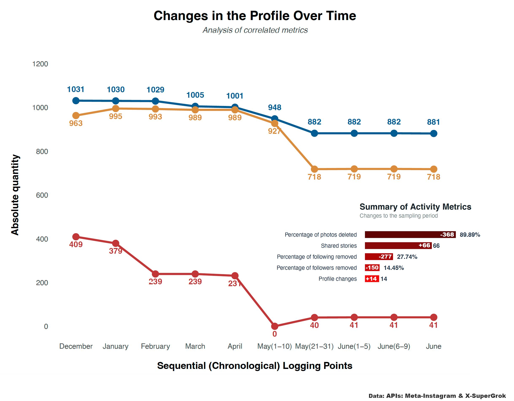

---
execute:
  message: false
  warning: false
  fig-show: no
title: "Social media analysis (using APIs Meta & X)"
author: "FV"
date: "2025-12-31"
categories: [code, analysis]
image: "rs1.png"
---

::: callout-important
ES
:::

En esta oportunidad se trabajan con datos extraídos a través de la API de Meta y X. Lo único que se necesita son las credenciales y claves Key que genera y proporciona cada plataforma. Antes de poder acceder a cualquiera de las claves y servicios, es necesario solicitar una autorización en el sitio web de desarrolladores de Meta y X.

La extracción de datos por estas vías están sujetas a las regulaciones de cada plataforma (se obtienen métricas en tiempo real, comentarios, urls y datos en tiempos especificos). Esta vez el compendio está desarrollado con Python (extracción) y R (manipulación de datos y gráficos) 
Este panel de control se ha creado en quarto. Se extrae la data y se actualiza el gráfico dinámicamente. Las APIs se ejecutan automáticamente tres veces por mes, puede configurarse al momento de crear las claves API y las peticiones de consulta, hay diferentes límites de tiempo disponibles. 

Ejemplo: API; https://github.com/freddyvillabona/extraer-tuits-tweepy/tree/master

::: callout-important
EN
:::

In this instance, we are working with data extracted via the Meta and X APIs. All you need are the credentials and K keys generated by each platform. Before you can access any of the keys, you must request authorisation from the Meta and X developer websites.

Built with Python and R. This dashboard is created in Quart. The API runs the queries three times a month. 

APIs: https://github.com/freddyvillabona/extraer-tuits-tweepy/tree/master

```{r}
# LIBRARIES
library(tidyverse)
library(ggpubr)
library(reshape2)
library(ggcorrplot)
library(ggcharts)
library(tmaptools)
library(prismatic)
library(patchwork)
library(gridExtra)
library(ggflags)
library(showtext)
library(camcorder)
library(ggtext)


# FONTS
font_add_google("Luckiest Guy","ramp")
font_add_google("Bebas Neue","beb")
font_add_google("Fira Sans","fira")
font_add_google("Raleway","ral")
font_add_google("Bitter","bit")
showtext_auto()


#p1
```


La psicología y la Ciencia de Datos tienen lazos muy importantes en la búsqueda de patrones. Este gráfico estadístico trabajado con regresión lineal múltiple y datos reales, representa un evento denominado tierrra quemada: ocurrido con un paciente después de un colapso emocional por carga de culpa,miedo a la soledad, presión, evasión, conflictos internos no resueltos y huida hacia adelante en complicidad.

Un analisis psicologico de María José Valiente por este caso con una metafora.
«Es algo como ejecutar un disparo y después ocultar el arma debajo de la alfombra, lavarse las manos y huir en  cómplicidad. Hay que desaparecer cualquier rastro digital, especialmente en redes sociales para no sentir. Solapar nexos y suprimir el pasado para poder vivir y no herir al entorno, tácticamente fingir ante los demás: aquí no ha pasando nada es solo un movimiento pequeño». —María José Valiente

Investigación realizada con Python, R APIs Meta & X.



