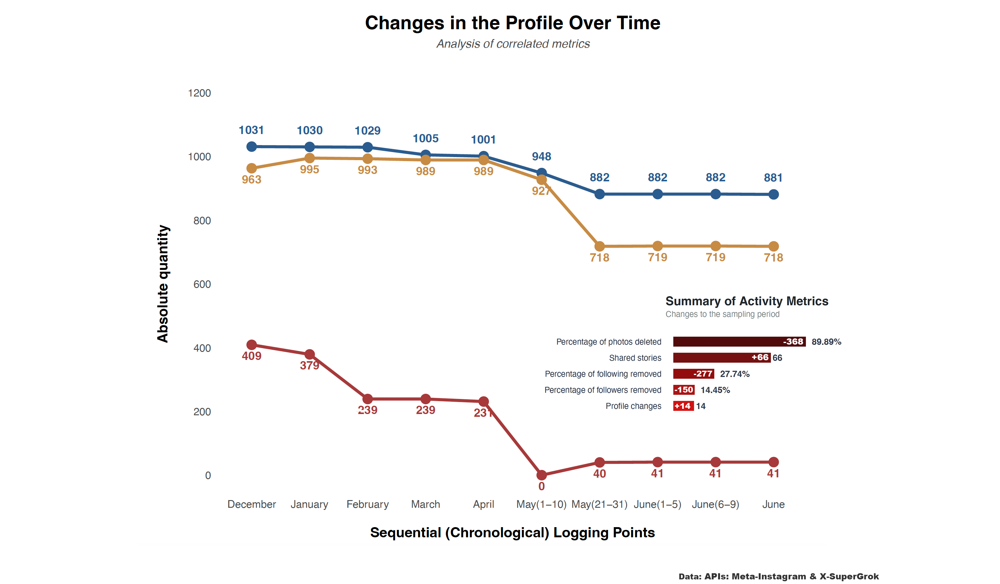

---
execute:
  message: false
  warning: false
  fig-show: no
title: "Social media analysis (using APIs Meta & X)"
author: "FV"
date: "2025-12-31"
categories: [code, analysis]
image: "rs.png"
---

::: callout-important
EN
:::

In this instance, we are working with data extracted via the Meta and X APIs. All you need are the credentials and K keys generated by each platform. Before you can access any of the keys, you must request authorisation from the Meta and X developer websites.

Built with Python and R. This dashboard is created in Quart. The API runs the queries three times a month. 

APIs: https://github.com/freddyvillabona/extraer-tuits-tweepy/tree/master

```{r}
# LIBRARIES
library(tidyverse)
library(ggpubr)
library(reshape2)
library(ggcorrplot)
library(ggcharts)
library(tmaptools)
library(prismatic)
library(patchwork)
library(gridExtra)
library(ggflags)
library(showtext)
library(camcorder)
library(ggtext)


# FONTS
font_add_google("Luckiest Guy","ramp")
font_add_google("Bebas Neue","beb")
font_add_google("Fira Sans","fira")
font_add_google("Raleway","ral")
font_add_google("Bitter","bit")
showtext_auto()


#p1
```


