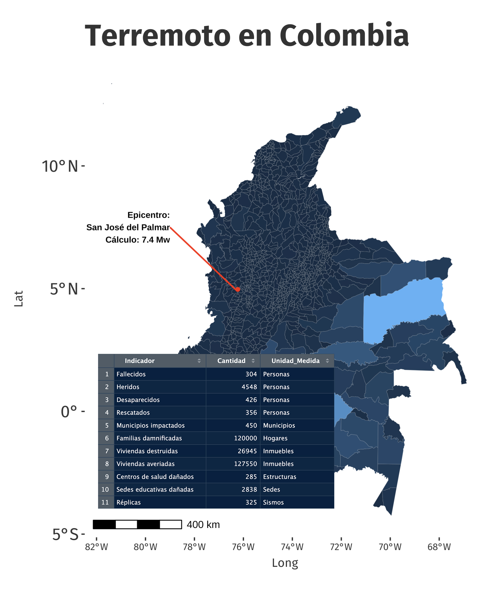

::: callout-important
🇨🇴 Ocurrió el 10 de agosto de 2026 a primeras horas de la mañana, registrando en San José del Palmar, Chocó, con una fuerte magnitud de 7.4 Mw (7:34 a. m. hora local). Ha sido catalogado por el Servicio Geológico Colombiano como el sismo más potente que ha golpeado al país en lo que va del siglo XXI.\
\
Características principales\
\
Epicentro y origen: Se localizó en el municipio de San José del Palmar, Chocó. Fue provocado por un proceso tectónico de subducción en el Cinturón de Fuego del Pacífico.Profundidad:\
\
Ocurrió a unos 107-110 kilómetros de la superficie. Aunque fue un sismo profundo, liberó una enorme cantidad de energía que se sintió con fuerza en gran parte del país y en naciones vecinas.\
\
Zonas más afectadas: El impacto destructivo se concentró principalmente en el suroccidente y la región del «Eje Cafetero». Ciudades como Cali, Pereira y Manizales reportaron la mayor cantidad de afectados.\
\
Datos: SGC 19-08-2026
:::

```{undefined}
#| eval: false
#| message: true
#| warning: true
#| code-fold: true
#| code-summary: Haz clic aquí para ver las 200 líneas de código

{
library("rvest")
library('sf')
library("ggplot2")
library("tmap")
library("unikn")
library("dplyr")
library("showtext")
library("unikn")
library("tidyverse")
library("mapchina")
library("ggspatial")
}

font_add_google("Fira Sans","fira")
showtext_auto()
map <- read_sf('shapes.shp')

g <- filter(map, nombre_mpi %in% c("CUMARIBO",
                                   "SOLANO",
                                   "SAN JOSE DEL GUAVIARE",
                                   "LA PRIMAVERA",
                                   "PUERTO SANTANDER"))
g <- g[-4,] 


paleta <- c("red","blue")
paleta <- unikn::usecol(paleta, n=5)


paleta <- RColorBrewer::brewer.pal(9, "Blues")
paleta
paleta <- paleta[4:9]

paleta2 <- head(rev(RColorBrewer::brewer.pal(9, "Blues")),5) 


bubble_sizes <- c(1,1,1,1,1)
punto <- "Municipios más extensos"

#GGPLOT2

ru <- map %>% 
  st_as_sf()

A <- ggplot(data = ru) + 
  ggtitle("Terremoto en Colombia") + 
  xlab("") + ylab("") + 
  # SOLUCIÓN: fill = NA (transparente) y color = "red" (borde)
  geom_sf(fill = NA, color = "red", size = 0.2) + 
  theme(plot.title = element_text(size = 16), plot.subtitle = element_text(size = 20)) + 
  annotation_scale() + 
  theme(text = element_text(family = "fira"), 
        panel.grid = element_blank(), 
        plot.title = element_text(size = 25, colour = "gray20", face = "bold"), 
        axis.text.y = element_text(size = 8, colour = "gray20"), 
        axis.title.x = element_text(size = 18, colour = "gray20"), 
        axis.title.y = element_text(size = 8, colour = "gray20"), 
        axis.text.x = element_text(size = 8, colour = "gray20"), 
        panel.background = element_rect(fill = 'white', color = 'white'), 
        legend.position = "none") 

A

pb <- data.frame(long = -76.23, lat = 4.97)

A <- ggplot(data = ru) + 
  ggtitle("Terremoto en Colombia") + 
  xlab("Long") + ylab("Lat") + 
  # SOLUCIÓN: aes(fill=area) mantiene tus colores internos, color="red" cambia los bordes
  geom_sf(aes(fill = area), color = "white", size = 0.02, show.legend = TRUE) + 
  theme(plot.title = element_text(size = 16), plot.subtitle = element_text(size = 20)) + 
  annotation_scale() + 
  annotate("segment", 
           x = -80.0, y = 6.5,         # Coordenadas de inicio (donde estará el texto)
           xend = -76.25, yend = 4.9,   # Coordenadas del epicentro (punto rojo)
           color = "red", 
           linewidth = 0.6,
           arrow = arrow(length = unit(0.2, "cm"))) + # Agrega una flecha en la punta
  
  # 2. Agregar la etiqueta de texto
  annotate("text", 
           x = -80.2, y = 6.5,         # Ubicación del texto (alineado con la línea)
           label = "Epicentro:\nSan José del Palmar", 
           color = "black", 
           fontface = "bold", 
           size = 1, 
           hjust = 1) +    
  geom_point(data = pb, aes(x = long, y = lat), 
             color = "red", size = 0.9, shape = 19) +
  theme(text = element_text(family = "fira"), 
        panel.grid = element_blank(), 
        plot.title = element_text(size = 25, colour = "gray20", face = "bold"), 
        axis.text.y = element_text(size = 14, colour = "gray20"), 
        axis.title.x = element_text(size = 10, colour = "gray20"), 
        axis.title.y = element_text(size = 10, colour = "gray20"), 
        axis.text.x = element_text(size = 8, colour = "gray20"), 
        panel.background = element_rect(fill = 'white', color = 'white'), 
        legend.position = "none") 

A
```


