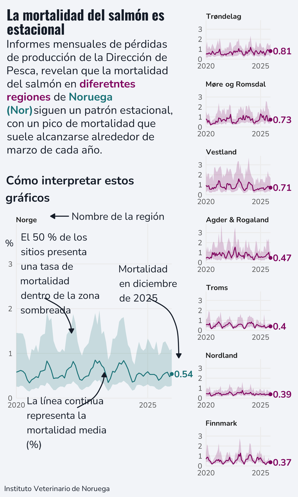

---
execute:
  message: false
  warning: false
  fig-show: no
title: "Informes mensuales de pérdidas de producción en Noruega"
author: "FV"
date: "2026-03-25"
categories: [code, analysis]
image: "noruega.png"
---


::: {.callout-important}
EN
::: 


 
This chart highlights the five countries with the highest coffee production in the world, taking into account various quality measures: aroma, flavor, aftertaste, acidity, body, balance, uniformity, cup cleanliness, sweetness, moisture, and defects.

::: {.callout-important}
ES
::: 

En este gráfico destacan los cinco países con mayor producción de café en el mundo, tomando en cuenta varias medidas de calidad: aroma, sabor, regusto, acidez, cuerpo, balance, uniformidad, limpieza de la taza, dulzura, humedad y defectos.

::: {.callout-important}
IT
::: 
*IT* Questo grafico evidenzia i cinque paesi con la più alta produzione di caffè al mondo, tenendo conto di vari parametri di qualità: aroma, sapore, retrogusto, acidità, corposità, equilibrio, uniformità, pulizia della tazza, dolcezza, umidità e difetti.

::: {.callout-important}
PT
::: 
*PT* Questo grafico evidenzia i cinque paesi con la più alta produzione di caffè al mondo, tenendo conto di vari parametri di qualità: aroma, sapore, retrogusto, acidità, corposità, equilibrio, uniformità, pulizia della tazza, dolcezza, umidità e difetti.

```{r}
library(tidyverse)
library(showtext)
library(ggtext)
library(glue)
library(ggview)
library(ggh4x)
library(cowplot)
library(grid)


# Load data ---------------------------------------------------------------

tuesdata <- tidytuesdayR::tt_load("2026-03-17")
monthly_losses_data <- tuesdata$monthly_losses_data
monthly_mortality_data <- tuesdata$monthly_mortality_data


# Load fonts --------------------------------------------------------------

font_add_google("Oswald")
font_add_google("Nunito")
showtext_auto()
showtext_opts(dpi = 300)
title_font <- "Oswald"
body_font <- "Nunito"


# Define colours and fonts-------------------------------------------------

bg_col <- "#F2F4F8"
text_col <- "#151C28"
highlight_col <- "#7F055F"


# Data wrangling ----------------------------------------------------------

region_data <- monthly_mortality_data |>
  filter(geo_group %in% c("county", "country"), species == "salmon") |>
  select(date, region, median, q1, q3)

end_plot_data <- region_data |>
  group_by(region) |>
  slice_max(date) |>
  arrange(desc(median)) |>
  ungroup()

plot_data <- region_data |>
  mutate(
    region = factor(region, levels = end_plot_data$region),
    region = fct_relevel(region, "Norge", after = 0)
  )

design <- "
  ##B
  ##C
  ##D
  AAE
  AAF
  AAG
  ##H
"

# Define text -------------------------------------------------------------


title <- glue("<span style='font-family:{title_font};font-size:15pt;'>**La mortalidad del salmón es estacional**</span><br>")
st <- glue("{title}Informes mensuales de pérdidas de producción de la Dirección de Pesca, revelan que la mortalidad del salmón en <span style='color:#7F055F;'>**diferetntes regiones**</span> de <span style='color:#197176;'>**Noruega (Nor)**</span>siguen un patrón estacional, con un pico de mortalidad que suele alcanzarse alrededor de marzo de cada año.")
cap <- c("Instituto Veterinario de Noruega")


# Plot --------------------------------------------------------------------

p <- ggplot(data = plot_data) +
  geom_ribbon(
    mapping = aes(
      x = date, ymin = q1, ymax = q3,
      fill = (region == "Norge"),
    ),
    alpha = 0.2
  ) +
  geom_line(
    mapping = aes(
      x = date, y = median,
      colour = (region == "Norge"),
    )
  ) +
  geom_point(
    data = slice_max(plot_data, date),
    mapping = aes(
      x = date, y = median,
      colour = (region == "Norge")
    )
  ) +
  geom_text(
    data = slice_max(plot_data, date),
    mapping = aes(
      x = date, y = median,
      colour = (region == "Norge"),
      label = paste0(" ", round(median, 2))
    ),
    hjust = 0,
    family = body_font,
    fontface = "bold"
  ) +
  facet_manual(vars(region), design = design, axes = "x") +
  scale_fill_manual(values = c(highlight_col, "#197176")) +
  scale_colour_manual(values = c(highlight_col, "#197176")) +
  scale_x_date(
    date_breaks = "5 years",
    date_labels = "%Y"
  ) +
  scale_y_continuous(limits = c(0, NA)) +
  labs(
    x = NULL, y = "%", caption = cap,
    tag = st
  ) +
  coord_cartesian(expand = FALSE, clip = "off") +
  theme_minimal(base_size = 10, base_family = body_font) +
  theme(
    plot.margin = margin(5, 30, 5, 5),
    plot.title.position = "plot",
    plot.caption.position = "plot",
    legend.position = "none",
    plot.background = element_rect(fill = bg_col, colour = bg_col),
    panel.background = element_rect(fill = bg_col, colour = bg_col),
    plot.tag.position = c(0.01, 0.99),
    plot.tag = element_textbox_simple(
      colour = text_col,
      hjust = 0,
      halign = 0,
      vjust = 1,
      valign = 1,
      margin = margin(b = 5, t = 0),
      family = body_font,
      maxwidth = 0.63
    ),
    plot.caption = element_textbox_simple(
      colour = text_col,
      hjust = 0,
      halign = 0,
      margin = margin(b = 0, t = 10),
      family = body_font
    ),
    strip.text = element_textbox_simple(
      face = "bold",
      margin = margin(t = 10),
      size = rel(0.8)
    ),
    axis.title.y = element_text(angle = 0, 
                                hjust = 1,
                                vjust = 0.5,
                                margin = margin(r = -5),
                                colour = text_col),
    panel.grid.minor = element_blank(),
    panel.spacing.x = unit(2, "lines"),
    panel.spacing.y = unit(1, "lines")
  ) 


p

ggdraw(p) +
  draw_text(
    x = 0.07, y = 0.45,
    size = 11,
    hjust = 0,
    colour = text_col,
    family = body_font,
    text = str_wrap("El 50 % de los sitios presenta una tasa de mortalidad dentro de la zona sombreada", 17)
  ) +
  draw_grob(
    curveGrob(
      x1 = 0.15, y1 = 0.40,
      x2 = 0.24, y2 = 0.33,
      curvature = -0.3,
      gp = gpar(col = text_col, lwd = 1.5, fill = text_col),
      arrow = arrow(type = "closed", length = unit(0.07, "inches"))
    )
  ) +
  draw_text(
    x = 0.09, y = 0.15,
    size = 11,
    hjust = 0,
    colour = text_col,
    family = body_font,
    text = str_wrap("La línea continua representa la mortalidad media (%)", 17)
  ) +
  draw_grob(
    curveGrob(
      x1 = 0.26, y1 = 0.18,
      x2 = 0.35, y2 = 0.25,
      curvature = 0.3,
      gp = gpar(col = text_col, lwd = 1.5, fill = text_col),
      arrow = arrow(type = "closed", length = unit(0.07, "inches"))
    )
  ) +
  draw_text(
    x = 0.24, y = 0.565,
    size = 11,
    hjust = 0,
    colour = text_col,
    family = body_font,
    text = str_wrap("Nombre de la región", 20)
  ) +
  draw_grob(
    curveGrob(
      x1 = 0.23, y1 = 0.565,
      x2 = 0.17, y2 = 0.565,
      curvature = 0,
      gp = gpar(col = text_col, lwd = 1.5, fill = text_col),
      arrow = arrow(type = "closed", length = unit(0.07, "inches"))
    )
  ) +
  draw_text(
    x = 0.4, y = 0.43,
    size = 11,
    hjust = 0,
    colour = text_col,
    family = body_font,
    text = str_wrap("Mortalidad en diciembre de 2025", 12)
  ) +
  draw_grob(
    curveGrob(
      x1 = 0.50, y1 = 0.40,
      x2 = 0.60, y2 = 0.28,
      curvature = -0.3,
      gp = gpar(col = text_col, lwd = 1.5, fill = text_col),
      arrow = arrow(type = "closed", length = unit(0.07, "inches"))
    )
  ) +
  draw_text(
    x = 0.02, y = 0.62,
    size = 13,
    hjust = 0,
    colour = text_col,
    fontface = "bold",
    family = body_font,
    text = str_wrap("Cómo interpretar estos gráficos", 30)
  ) +
  canvas(
    width = 4.5, height = 7.5,
    units = "in", bg = bg_col,
    dpi = 300
  ) -> p


p

```



